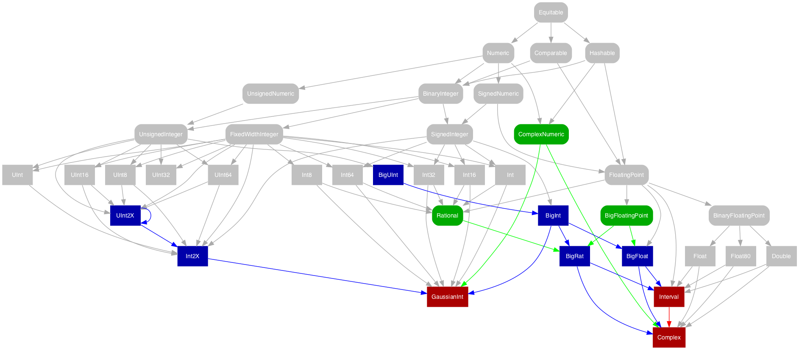
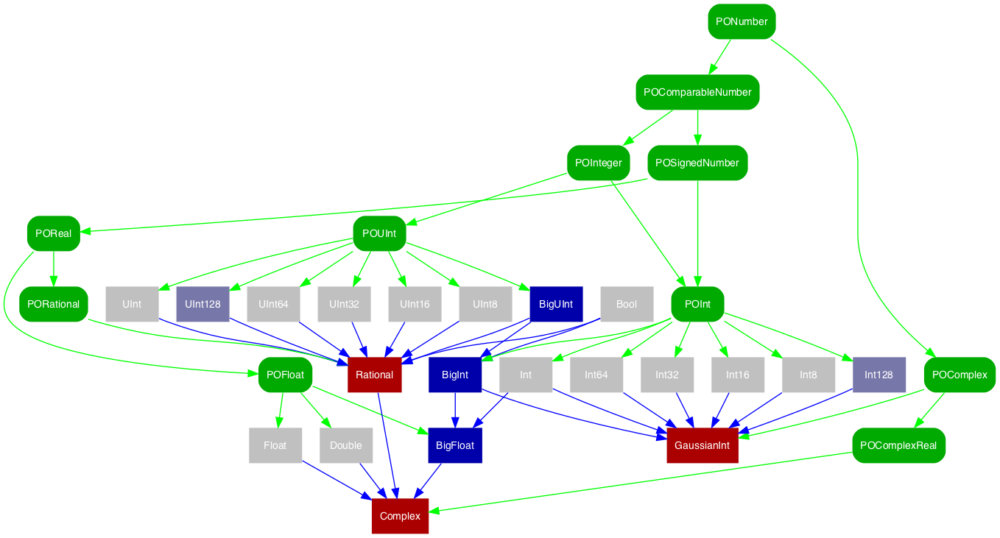

[](https://swift.org)
[](LICENSE)
[](http://travis-ci.org/dankogai/swift-pons)

# swift-pons

Protocol-Oriented Number System in Pure Swift

## Synopsis

```swift
var bi = BigInt(1) << 1024 - 1          // BigInt
var bq = BigInt(1).over(BigInt(2))      // BigRat
bq = BigRat.sqrt(bq)                    // and Its math functions
var bf = BigFloat(bq)                   // and BigFloat
BigFloat.acos(bf)                       // and Its math functions, too
var cd  = Complex.sqrt(-1.0)            // and Complex<Double>
let pi128 = BigFloat.PI(precision:128)
var cbf = Complex.exp(pi128.i)          // and Complex<BigFloat>
// and more!
```

## Description

Back in the day of Swift 2, PONS was created to demonstrate

```swift
func fib<T:SomeType>(_ n:T)->T {
    return n < 2 ? n: (2...Int(n)).reduce((T(0), T(1))){
        (p, _) in (p.1, p.0 + p.1)
    }.1
}

let F11  = fib(11 as Int8)
let F13  = fib(13 as UInt8)
let F23  = fib(23 as Int16)
let F24  = fib(24 as UInt16)
let F46  = fib(46 as Int32)
let F47  = fib(47 as UInt32)
let F92  = fib(92 as Int64)
let F93  = fib(93 as UInt64)
let F666 = fib(666 as BigInt)
```

is possible.  With [SE-0104] which is implemented in Swift 4, you can do that out-of-the-box.  Just replace `SomeType` with `BinaryInteger` and it just works.  Ironically that [broke the previous version] but I am glad Swift has evolved the way it should be.  What I was not so happy was that PONS was more than a prototype of protocol-oriented numeric types.  It offered

[SE-0104]: https://github.com/apple/swift-evolution/blob/master/proposals/0104-improved-integers.md
[broke the previous version]: https://github.com/dankogai/swift2-pons

* Arbitrary-precision Integer (`BigInt`)
* Arbitrary-precision Rational (`BigRat`)
* Arbitrary-precision Floating Point (`BigFloat`)
* Generic `Complex`.

and so forth.  So I decided to restore them but this time with Swift Standard Library and Swift Package Manager.  See the graph below.



As you see most types are Swift built-ins and the new PONS acts as an add-on.  Now see the graph below.



This is what PONS was.  Virtually all necessary protocols and types were custom-made.

PONS was also too monolithic, which was ironical because the best part of the protocol-oriented programming was modularization, or distribution of labor.  Thanks to Swift Package Manager PONS is modular.  `BigInt`, for instance, is fetched from [attaswift/BigInt].  PONS is now an aggregator module that aggregates the following:

PONS was also too monolithic, which was ironical because the best part of the protocol-oriented programming was modularization, or distribution of labor.  Thanks to Swift Package Manager PONS is modular.  `BigInt`, for instance, is fetched from [attaswift/BigInt].  PONS is now an aggregator module that aggregates the following:

[attaswift/BigInt]: https://github.com/attaswift/BigInt
